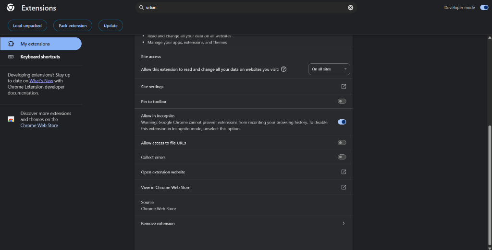

<div align="center">

# 🔐 SheerID Verification Tool

[](https://github.com/ThanhNguyxn/SheerID-Verification-Tool/stargazers)
[](https://github.com/ThanhNguyxn/SheerID-Verification-Tool/network/members)
[](https://opensource.org/licenses/MIT)

**Una guía multilingüe completa para ayudar a los estudiantes a obtener Gemini Advanced & ChatGPT Plus gratis a través de programas de verificación estudiantil.**

<p align="center">
  <a href="https://thanhnguyxn.github.io/SheerID-Verification-Tool/">
    
  </a>
  <a href="https://thanhnguyxn.github.io/student-card-generator/">
    
  </a>
  <a href="#-índice">
    
  </a>
  <a href="https://github.com/ThanhNguyxn/SheerID-Verification-Tool/issues">
    
  </a>
</p>

</div>


---

## 📖 Acerca del Proyecto

**SheerID Verification Tool** proporciona una guía paso a paso para que estudiantes de todo el mundo accedan gratis a la plataforma de IA Gemini Advanced de Google. Esta herramienta simplifica el proceso de verificación usando el sistema de verificación de estudiantes SheerID, permitiendo a los estudiantes desbloquear características premium incluyendo Gemini Advanced, 2TB de almacenamiento en Google Drive, NotebookLM Pro y créditos de creación de video con IA.

### ✨ Características

- 🌍 **Soporte Multilingüe** - Disponible en inglés, vietnamita, español, francés, alemán y chino
- 📋 **Guía Paso a Paso** - Instrucciones claras para todo el proceso de verificación
- 🔒 **Enfocado en Seguridad** - Enfatiza prácticas seguras y fuentes confiables
- 🎁 **Beneficios Premium** - Acceso a Gemini Advanced, ChatGPT Plus, 2TB de almacenamiento y más
- 🤖 **Integración con Bot de Telegram** - Verificación automatizada a través de bots de Telegram seguros
- 🆓 **Completamente Gratis** - Sin costos ocultos durante el período de estudiante gratuito

---

## 📚 Tabla de Contenidos

- [⚠️ Descargo de Responsabilidad](#️-descargo-de-responsabilidad)
- [📋 Requisitos](#-requisitos)
- [🚀 Instalación y Uso](#-instalación-y-uso)
- [🎁 Beneficios](#-beneficios)
- [⚠️ Notas de Seguridad](#️-notas-de-seguridad)
- [🔗 Recursos Adicionales](#-recursos-adicionales)
- [💖 Apoyar el Proyecto](#-apoyar-el-proyecto)
- [📄 Licencia](#-licencia)

---

## ⚠️ Descargo de Responsabilidad

> [!WARNING]
> **Solo Uso Educativo** - Esta guía es solo para fines informativos.

**📁 Qué Hace Esta Herramienta:**
- 🔗 Actúa como un **directorio** a servicios de verificación de terceros
- 📖 Proporciona **guías educativas** para verificación de estudiantes

**🚫 Qué No Hacemos:**
- ❌ **NO** alojamos, operamos ni gestionamos bots de Telegram
- ❌ **NO** somos responsables de la seguridad o privacidad de datos de bots de terceros
- ❌ **NO** estamos afiliados con Google, SheerID o Telegram

**✅ Tus Responsabilidades:**
- 👤 Eres responsable de tus propias acciones
- 📜 Debes cumplir con los Términos de Servicio de Google
- 🔒 Verifica la autenticidad del bot antes de compartir información

> [!CAUTION]
> **Usar bajo tu propio riesgo** - Siempre verifica las fuentes antes de proporcionar información personal.

---

## 📋 Requisitos

Antes de comenzar, asegúrate de tener:

- ✅ **Cuenta de Telegram** - Para verificación por bot
- ✅ **Cuenta de Google/OpenAI** - Una cuenta válida para verificación
- ✅ **Método de pago válido** - Tarjeta bancaria o billetera electrónica (sin cargo para paquete gratuito)
- ✅ **VPN** - (por ejemplo, Urban VPN) para cambiar región a US u otros países elegibles si es necesario

## 🚀 Instalación y Uso

### 🌐 Paso 1: Configurar tu Navegador

1. **Crea un nuevo perfil de navegador** o usa el modo incógnito para evitar conflictos de datos

2. **Instala una extensión VPN** (omítelo si ya estás en una región compatible como **US**):
   - [Urban VPN](https://chrome.google.com/webstore/detail/urban-vpn) (Chrome/Edge)
   - [Proton VPN](https://protonvpn.com/) (Todos los navegadores)
   - O cualquier VPN confiable

> [!IMPORTANT]
> **¿Usando modo incógnito?** Ve a la configuración de extensiones y habilita **"Permitir en incógnito"** para que tu VPN funcione.
>
> 

> [!TIP]
> Conecta a **US u otros países elegibles** antes de pasar al Paso 2.

### 🎓 Paso 2: Acceder al Programa para Estudiantes

Elige tu programa y obtén tu enlace de verificación:

| Programa | Enlace | Para |
|----------|--------|------|
| 🤖 **Google Gemini** | [gemini.google/students](https://gemini.google/students) | Estudiantes universitarios |
| 💬 **ChatGPT Plus** | [chatgpt.com/plans/k12-teachers](https://chatgpt.com/plans/k12-teachers/) | Profesores K-12 |

Haz clic en **Join Student Program** o botón equivalente para recibir tu enlace de verificación.

> [!IMPORTANT]
> **Elegibilidad del País:** Si tu país no es compatible, usa una VPN para cambiar a un país elegible (US, etc.).
> 
> **💡 Consejo:** Busca "Google Student Program supported countries" en línea.

### 📱 Paso 3: Verificar Estado de Estudiante vía Telegram

1. Abre Telegram y accede a uno de estos bots:
   - [SheerID VIP Bot](https://t.me/SheerID_VIP_Bot?start=ref_REF001124) ✅ *Soporta GPT K12*
   - [SheerID VN Bot](https://t.me/sheeridvn_bot?start=invite_7762497789)

2. Envía el comando apropiado según tu programa:

   **Para Google Gemini:**
   ```
   /verify https://services.sheerid.com/verify/***
   ```
   
   **Para ChatGPT Plus (K-12):**
   ```
   /vc https://services.sheerid.com/verify/***
   ```
   
   *(Reemplaza con tu enlace de verificación)*

3. Espera la confirmación del bot

> [!TIP]
> **💰 ¡Completamente Gratis!** Gana monedas gratis:
> - Invitando amigos al bot
> - Usando `/checkin` diariamente para ganar puntos
> 
> *¿Necesitas monedas urgentes? También ofrecemos opciones de recarga.*

> [!WARNING]
> **¿Tienes un error?** Usa el comando `/fix` y pega tu enlace de verificación de nuevo. Si los errores persisten, prueba con una cuenta de Google diferente.

### ✨ Paso 4: Activar tu Plan Premium

**Para Google Gemini:**
1. Después de la verificación, regístrate en **Google One AI Premium**
2. Agrega tu método de pago (sin cargo durante el período gratuito)
3. Completa el registro

**Para ChatGPT Plus:**
1. Después de la verificación, tu ChatGPT Plus se activará automáticamente
2. ¡Disfruta tu suscripción gratuita!

> [!NOTE]
> **Usuarios de VPN:** Después de la verificación, desconecta la VPN y recarga la página antes de añadir el método de pago.

### ⚙️ Paso 5: Gestionar tu Suscripción

Visita [Suscripciones de Google Play](https://play.google.com/store/account/subscriptions) para cancelar antes de que termine el período de 12 meses.

**⏰ Consejo:** ¡Configura un recordatorio en el calendario para evitar cargos de renovación automática!

## 🎁 Beneficios

Al completar con éxito, recibirás:

**Google Gemini:**
- ✨ **Gemini Advanced** - Gratis por 12 meses
- 💾 **2TB Google Drive** - Amplio almacenamiento en la nube
- 📝 **NotebookLM Pro** - Capacidades avanzadas para tomar notas
- 🎥 **1,000 créditos de video AI** - Crea videos con VEO3

**ChatGPT Plus:**
- 💬 **ChatGPT Plus** - Gratis para profesores K-12
- 🧠 **Acceso a GPT-4o** - Capacidades avanzadas de IA
- 🎨 **DALL·E y más** - Generación de imágenes y funciones avanzadas

## ⚠️ Notas de Seguridad

- 🔐 Usa solo fuentes de bots confiables listadas en esta guía
- 🚫 Nunca compartas información de pago con terceros
- ⏰ Después de 12 meses, el paquete se convertirá en pago si no se cancela

## 🔗 Recursos Adicionales

**Verificación alternativa:** Si no puedes verificar a través de Telegram, usa la [SheerID Verification Tool](https://thanhnguyxn.github.io/SheerID-Verification-Tool/)

**Enlaces oficiales:**
- [Google One AI Premium](https://one.google.com)
- [Gemini Help Center](https://support.google.com/gemini)

---

## 💖 Apoyar el Proyecto

Si encuentras esta guía útil, considera apoyarla para ayudar a mantener y mejorar el proyecto:

<a href="https://buymeacoffee.com/thanhnguyxn" target="_blank"></a>

---

## 🌐 Otros Idiomas

- [🇬🇧 English](../README.md)
- [🇻🇳 Tiếng Việt](README.vi.md)
- [🇪🇸 Español](README.es.md)
- [🇫🇷 Français](README.fr.md)
- [🇩🇪 Deutsch](README.de.md)
- [🇨🇳 中文](README.zh.md)
- [🇧🇷 Português](README.pt-BR.md)
- [🇷🇺 Русский](README.ru.md)
- [🇯🇵 日本語](README.ja.md)
- [🇰🇷 한국어](README.ko.md)
- [🇮🇩 Indonesia](README.id.md)
- [🇮🇳 हिन्दी](README.hi.md)
- [🇸🇦 العربية](README.ar.md)
- [🇹🇷 Türkçe](README.tr.md)
- [🇮🇹 Italiano](README.it.md)
- [🇹🇭 ไทย](README.th.md)
- [🇵🇱 Polski](README.pl.md)

---

## 📄 Licencia

Este proyecto está licenciado bajo la Licencia MIT - consulta el archivo [LICENSE](LICENSE) para más detalles.

Copyright (c) 2025 SheerID Verification Tool Contributors

---

<div align="center">

**Hecho con ❤️ para estudiantes de todo el mundo**

Si encontraste esta guía útil, por favor considera darle una ⭐ en [GitHub](https://github.com/ThanhNguyxn/SheerID-Verification-Tool)!

[⬆ Volver arriba](#-sheerid-verification-tool)

</div>
